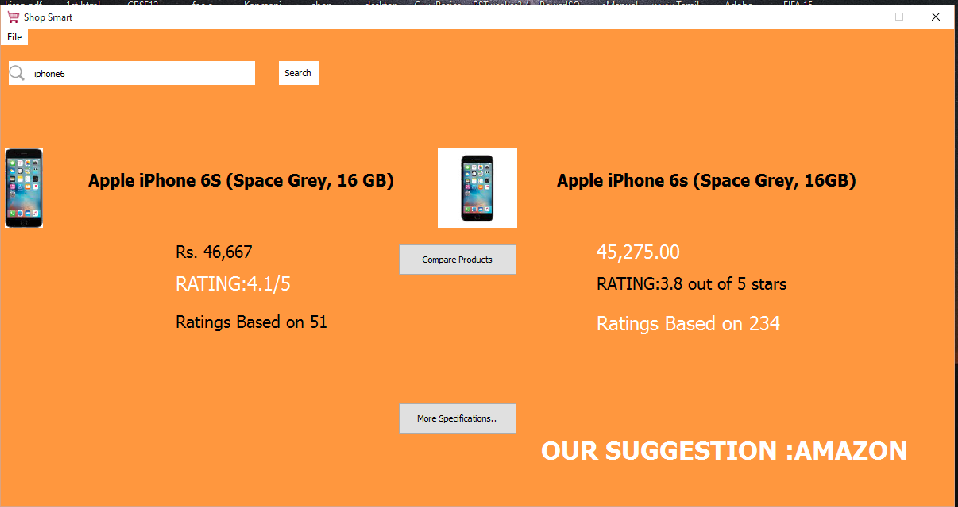

Welcome to Shop Smart!
===================

What is Shop Smart?
---------------------------

Shop Smart is an application which helps the users to make right choices while shopping online, Users can search for a product in the application which will provide the user all the details of the products like prices, specifications, user ratings and comments from the two popular websites Amazon and Flipkart. 

How does it work?
---------------------------
Shop Smart utilize the Python lxml and request library to crawl the websites of Amazon and Flipkart to get the desired data. When the user searches for a product the application scrapes through both Amazon and Flipkart websites to get the top 7 best matches of the products and prompts the user to select one of it. As the user clicks on the products the application crawls to the product page in order to get the details and ratings of the products from both the websites and compares the products from the two sites to suggest the user the best buy.
	
Scree Shot
---------------------------

**Final Screen**

 

